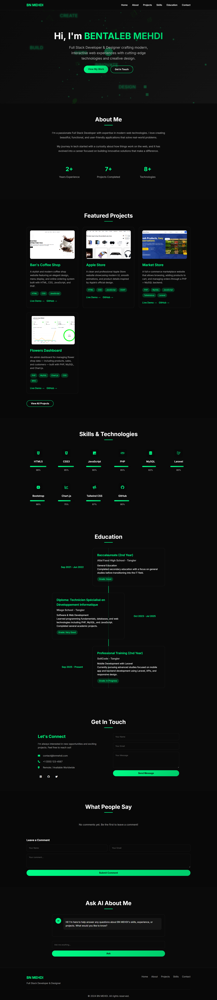

# 💻 Mehdi Ben Taleb Web Development Portfolio 2026

A professional showcase of my web development projects built with **HTML, CSS, JavaScript, and Three.js**. Features interactive interfaces, 3D effects, animations, and fully responsive designs. Includes live demos, screenshots, and project documentation.

---

## ✨ Features

- 🌐 **Interactive Web Interfaces** – Smooth, user-friendly UI designs
- 🎨 **3D Effects & Animations** – Built with Three.js for engaging visuals
- 📱 **Responsive Design** – Optimized for desktop, tablet, and mobile
- 📸 **Screenshots & Demos** – Live previews of each project
- 📂 **Well-documented** – Clear structure and code documentation

---

## 🛠️ Tech Stack

-  **HTML5**
-  **CSS3**
-  **JavaScript**
-  **Three.js**

---

## 📸 Screenshots

### Portfolio page

---

## 🚀 Live Demo

_[click for Demo Portfolio " Mehdi Bentaleb "](https://mehdy-bentaleb.vercel.app/)_
